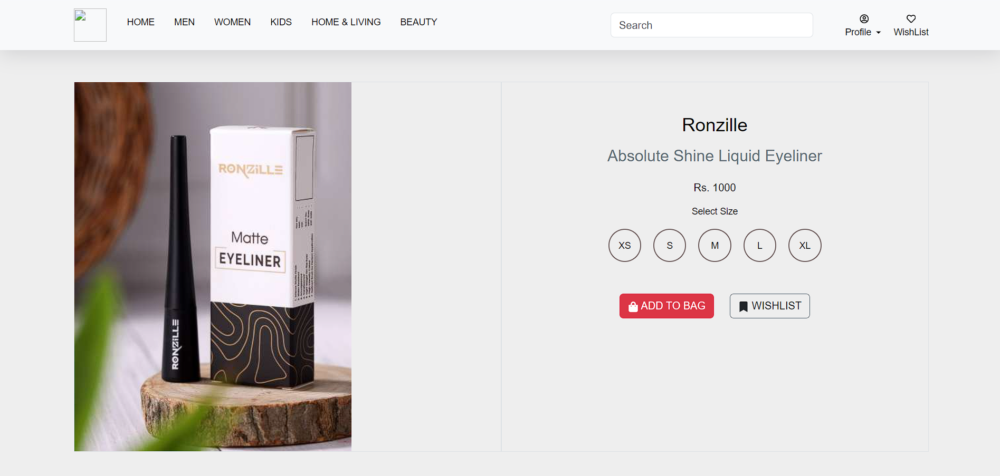
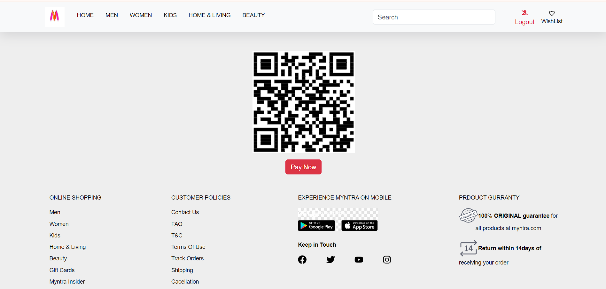
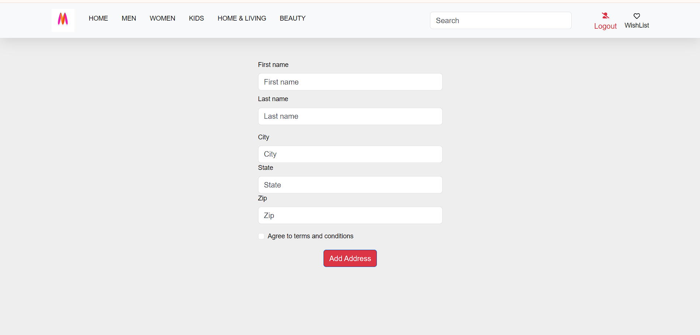

this is my video link="https://drive.google.com/file/d/1zkJSNFnYyA7MrknRXxJqsu8h-Ld10b4m/view?usp=sharing"

    <h1>Features</h1>
    <ul>
        <li> User Authentication: Users can sign up, log in, and log out using Firebase Authentication.</li>
        <li>Product Listing: Browse through a variety of products with filtering options like category, price, and more.</li>
        <li>Product Details: View detailed information for each product, including images, descriptions, and pricing.</li>
        <li>Shopping Cart: Add items to the cart, update quantities, and remove products.</li>
        <li>Checkout: Proceed to purchase items with a mock checkout process.</li>
        <li>Responsive Design: Optimized for desktop and mobile viewing.</li>
        <li>Real-time Database: Data fetched and managed using Firestore (Firebase).</li>
        <li>Payment Integration: (Optional) Stripe or other payment gateway can be integrated for real payment processing.</li>
    </ul>

    <h1>Tech Stack</h1>
    <ul>
        <li>Frontend: React.js, CSS</li>
        <li>Backend: Firebase (Firestore, Authentication)</li>
        <li>Tools: Axios for API calls, React Router for navigation</li>
        <li>Version Control: Git and GitHub</li>
    </ul>

    <h1>Installation</h1>
    
Follow these steps to run the project locally:

    <h1>Prerequisites</h1>
    <ul>
        <li>Node.js installed on your machine</li>
        <li>Firebase account set up for Firestore and Authentication</li>
    </ul>
    <h2>Steps</h2>
    <ol>
        <li>Clone the repository:</li>
        
git clone https://github.com/patilrohit1964/myntra_clone.git

        <li>Navigate to the project directory:</li>
        
cd myntra_clone

        <li>Install dependencies</li>
        
npm install

        <li>npm run dev</li>
    </ol>

    <h1>Usage</h1>
    <ul>
        <li>Browse through the available products and view details for each one.</li>
        <li>Add products to your cart and proceed to checkout.</li>
        <li>Use the mock checkout flow to simulate purchasing products.</li>
    </ul>

    <h1>Future Improvements</h1>
    <ul>
        <li>Integrating a real payment gateway like Stripe or PayPal.</li>
        <li>Adding user reviews and ratings for products.</li>
        <li>Implementing order history and tracking.</li>
        <li>Adding a search bar with real-time filtering.</li>
    </ul>

    <h1>Contributing</h1>
    
Contributions are welcome! Feel free to open a pull request or issue to discuss improvements or new features.

